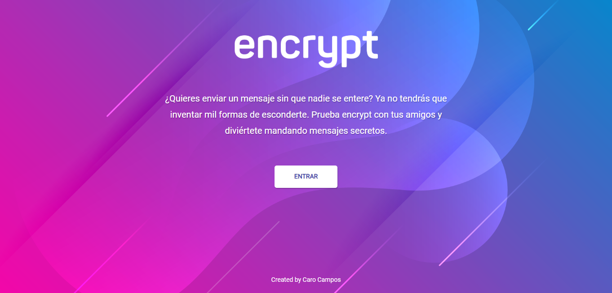

# Encrypt-text

¿Quiéres enviar un mensaje sin que nadie se entere? Ya no tendrás que inventar mil formas de esconderte. Prueba Encrypt-text con tus amigos y diviértete mandando mensajes secretos.

## Definición del producto:

Encrypt-text es una aplicación web que permite a los usuarios poder mandar mensajes secretos. El objetivo es que jóvenes adolescentes puedan comunicarse de manera secreta y privada sin necesidad de ocultar su pantalla (desktop, tablet. mobile) a los demás.

## ¿Cómo usar Encrypt-text? 

1. Ingresa a: [Encrypt-text](https://carocampos.github.io/lim-2018-11-bc-core-am-cipher/src/)
2. Ingresa el texto que deseas encriptar.
3. Ingresa el número de posiciones a desplazar para encriptar tu mensaje
4. Haz click en cifrar para encriptar tu mensaje y en descifrar para descubrir el mensaje encriptado.
5. Compartir en redes sociales y whatsapp (por implementar)

## Principales Usuarios:

Encrypt-text está dirigido a jóvenes entre 14 a 17 años que buscan mantener sus conversaciones en total privacidad. Una reacción particular de esa edad es la timidez, la idea de que otra persona pueda leer sus conversaciones muchas veces los aterra e inclusive hasta puede llegar a ser un motivo de bullying entre sus amigos.

## Atacar el problema:

La iniciativa de Encrypt-text es darles total privacidad y seguridad a estos jóvenes de que podránr enviar un mensaje sin que otra persona pueda leerlo. De esta manera sus mensajes quedarán completamente ocultos, ya que ellos y sus receptores serán los únicos que tendrán acceso a la clave del mensaje.

## Interfaz de usuario

La interfaz permite al usuario:
- Elegir un desplazamiento (_offset_) indicando cuántas posiciones queremos que el cifrado desplace cada caracter.
- Insertar un mensaje (texto) que queremos cifrar.
- Ver el resultado del mensaje cifrado.
- Insertar un mensaje (texto) a descifrar.
- Ver el resultado del mensaje descifrado.
